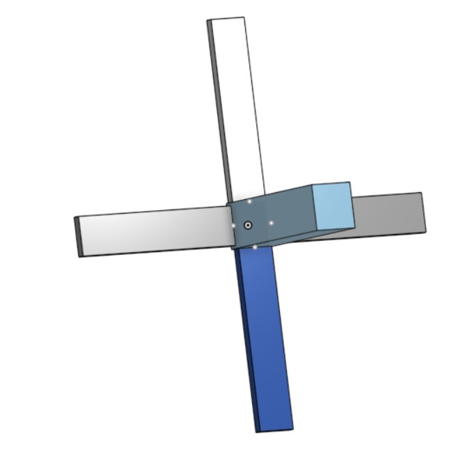
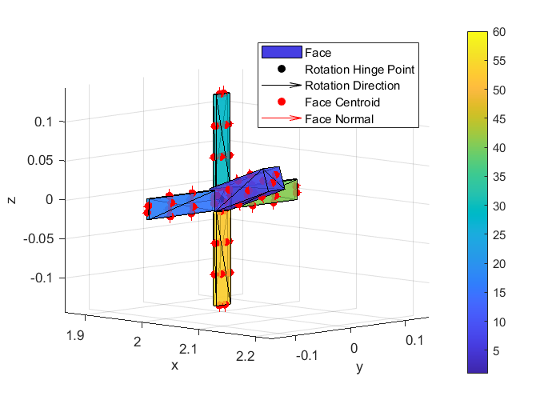
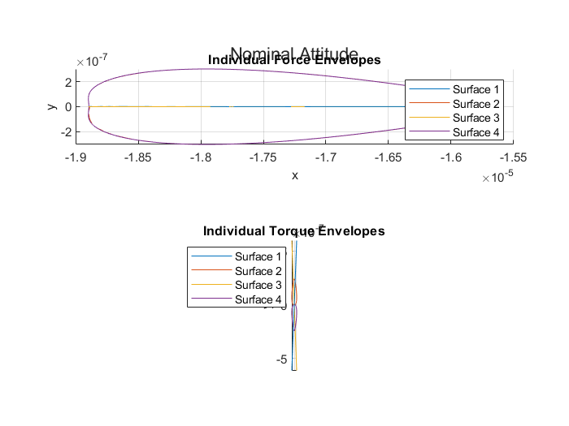
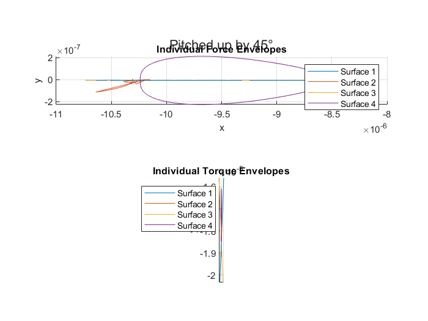

# How to: VLEO Aerodynamic Tool , simple example
This HowTo.md serves as a step-by-step guide to the vleo-aerodynamics-tool in the Sadycos project. It provides a structured introduction using a simple example: rotating the main body of a satellite around the negative y-axis. This example illustrates the key steps and commands required to work with the simulation. The primary objective is to compute the aerodynamic forces and torques acting on the satellite's control surfaces.

## Preparatory work

Let´s assume you conduct research work in the field of attitude and aerodynamic control of VLEO satellites and are interested in the forces and torques acting on your satellite configuration.

The satellite is a prototype created in CAD and consists of a main body which has a rotatable wing on each side of your satellite back end. Note that the main body as well as each wing of the satellite should be a part of its own, as we want to be able to rotate each wing independent to each other. 

The following satellite configuration can be used for reference:


It consists of five parts. The main body and four wings or control surfaces which are divided in right, left, bottom and top. 

You can then export these parts as independent .obj-files.

**Remember to check the box "Export unique parts as individual files"**


Now to the environmental part.
In order to work with the VLEO Aerodynamics Tool you need to clone the Sadycos GIT-Repository and initialize the submodules as shown in [README.md](README.md.md).


## Import of bodies

The satellite configuration you created and exported in the CAD program of your choice can now be imported into the workflow. 
Here ``object_files`` imports the individual files by calling its exact name. Make sure to keep them in the same path as the one you are working in. 

```Matlab
% Create inputs to import function
% Get absolute path of test folder
[test_folder,~,~] = fileparts(mfilename("fullpath"));
% Get absolute paths of all obj files
object_files = string(fullfile(test_folder, 'obj_files_test', ...
                                {'body_test.obj', ...
                                     'right_control_surface_test.obj', ...
                                     'bottom_control_surface_test.obj', ...
                                     'left_control_surface_test.obj', ...
                                     'top_control_surface_test.obj'
                                     }));
```
To ckeck, if the parts are correctly imported call object_files in the command window.

In the case of this example, consisting of five unique parts, the command bar should return a 1x5 string array consisting of the path to the .obj-files:

```git bash
object_files = 

  1×5 string array

    "C:\Users\maier\Docume…"    "C:\Users\maier\Docume…"    "C:\Users\maier\Docume…"    "C:\Users\maier\Docume…"    "C:\Users\maier\Docume…"
```    

## Prepare imported bodies for processing

The following commands ensure that the satellite parts are formatted correctly, allowing for accurate torque and force calculations in the next step.

**Be aware of the dimensions between your CAD frame and the Matlab frame.**

```Matlab
rotation_hinge_points_CAD = [0,  0,  0, 0,  0; ...
                             0,   0,  0,   0,  0; ...
                             0,   0, 0,  0, 0];


rotation_directions_CAD = [1,  1,  0,  1,  0; ...
                           0,  0,  0,  0,  0; ...
                           0,  0,  1,  0,  1];


surface_temperatures__K = num2cell([300, 300, 300, 300, 300]);


surface_energy_accommodation_coefficients = num2cell(0.9*ones(1,5));


DCM_B_from_CAD = [0, -1, 0;...
                    -1, 0, 0; ...
                    0, 0, -1];


CoM_CAD = [0; 2; 0];
```
``rotation_hinge_points_CAD`` defines hinge points in the CAD coordinate frame. This can be designed as one would like. In this example, no hinge points are defined. 

``rotation_directions_CAD`` defines the axis for rotation of each part. Remember that this is in the CAD frame, so the main body, wing 1 and 3, which are name ``right_conrol_surface`` and ``left_control_surface``, rotate with respect to the x-axis and wing 2 and 4 with respect to the z-axis.

``surface_temperatures__K`` defines the surface temperatures at each part of the satellite. This plays a big part in the gas-surface interaction we are experiencing in the VLEO.
In this case we set it to 300 Kelvin (~27 degree celsius)


``surface_energy_accommodation_coefficients`` influences how much energy gas molecules retain or lose, which affects satellite aerodynamics and atmospheric drag in Very Low Earth Orbit. In our example these are set pretty high, indication that molecules striking the surface adopt its temperatures

``DCM_B_from_CAD`` is better known as the Direction Cosine Matrix and represents the rotation from the CAD coordinate frame to the body-fixed frame. It transforms vectors from the CAD frame (the coordinate system used to design the satellite) into the body frame (which moves with the satellite).

In our case, the Matrice can be interpreted as follows: 

- The second row [-1, 0, 0] means the X-axis of the CAD system is aligned with the negative Y-axis of the body frame.
- The third row [0, 0, -1] means the Z-axis of the CAD system is flipped to the negative Z-axis in the body frame.

``CoM_CAD`` defines the Center of Mass (CoM) of the satellite in CAD coordinates. The vector [0; 2; 0] means the center of mass is 2 units along the Y-axis in the CAD reference frame.

**For more details, see the README file.**

## importMultipleBodies-function

The ``importMultipleBodies`` function is defines in a submodule and has all of the above defined arguments as input. 

```Matlab
bodies = importMultipleBodies(object_files, ...
    rotation_hinge_points_CAD, ...
    rotation_directions_CAD, ...
    surface_temperatures__K, ...
    surface_energy_accommodation_coefficients, ...
    DCM_B_from_CAD, ...
    CoM_CAD);
```

It outputs a 1x5 cell array consisting of 1x1 structs consisting of the geometrical informations defining each part.
```
bodies =

  1×5 cell array

    {1×1 struct}    {1×1 struct}    {1×1 struct}    {1×1 struct}    {1×1 struct}
```

## showBodies-function

The ``showBodies``-function is also in a submodule and helps visualizing the satellite. With that you are able to see how the changes you made influence the movement of your satellite. It also helps with validation.

```Matlab
showBodies(bodies, [deg2rad(20), 0, 0, 0 ,0], 0.75, 0.25, ...
    {(1:12), 12 + (1:12), 24 + (1:12), 36 + (1:12), 48 + (1:12)});
```
In this example i want to focus on the second argument of the showBodies- function. It consists of a vector, that determines the value of the rotation of each part. 

Earlier we determined the ``rotation_direction_CAD`` with respect to the CAD frame. This rotation direction can be transformed via the Direction Cosine Matrice ``DCM_B_from_CAD``, which makes sure that the coordinates are in the body-fixed frame.

So to put it in the perspective of a simple example:

We only want the main body to rotate 20 degrees with respect to the negative y-axis. 

- The rotation in the CAD frame is with respect to the x-axis, as seen above.
- The Direction Cosine Matrice transformes the x-axis from CAD in the -y-axis of the body-fixed frame.
- In the argument of the showBodies function, we defined a angle of 20 degree

Result: 

## Calculate the aerodynamic forces and torques for different control surface rotations
In order to calculate the aerodynamic forces and torques several environmental parameters have to be definded. You can configurate them as you wish. 

```Matlab
% Constants
altitude__m = 3e5;
gravitational_parameter__m3_per_s2 = 3.986e14;
radius__m = 6.378e6;

rotational_velocity_BI_B__rad_per_s = 0;
velocity_I_I__m_per_s = sqrt(gravitational_parameter__m3_per_s2 ...
                             / (radius__m + altitude__m)) * [1;0;0];
wind_velocity_I_I__m_per_s = zeros(3,1);
[T, R] = atmosnrlmsise00(altitude__m, 0, 0, 2024, 150, 0);
density__kg_per_m3 = R(6);
temperature__K = T(2);
particles_mass__kg = 16 * 1.6605390689252e-27;
temperature_ratio_method = 1;
```
The temperature and density are computed via the ``atomsnrlsise00`` function defined in the Aerospace Toolbox in Matlab. For further information check the Toolbox Doc.

Before calculating the torques and forces acting on the control surfaces of the satellite you need to preallocate the arrays/matrices, where the aerodynamic force results and the torque matrix will be stored. In this ecample the dimensions are as follows:
- 3, representing the force components in the body frame
- num_angles, representing the different control angles, which will be explained below
- 4 different control surfaces, the wings
- 2 different attitude cases, which will be explained in the next code snippet

With ``num_angles`` and ``control_surface_angles_rad`` you are able to provide a high resolution range of the control surface deflections. In this example, we want to make sure that the possible aerodynamic configurations from neutral (0) to macimum deflection($\pi$) are covered.

```Matlab
num_angles = 101;
control_surface_angles__rad = linspace(0, pi, num_angles);
aerodynamic_force_B__N = nan(3, num_angles, 4, 2);
aerodynamic_torque_B_B__Nm = aerodynamic_force_B__N;
```
Now we have this big loop where we distinguish between two attitude cases.
Weiss nicht eichtig warum....
For $k=1$ we have no rotation, which can be used as the base case.

$k=2$ presents a rotation of -45 degrees around the y-axis, as defines in `dir = [0; 1; 0]`, which changes the aerodynamic forces due to different angles of attacks.

The satellites attitude is express using the quaternion representation of the rotation to avoid numerical instabilities and singularities. With `cos(attitude_anlge/2)`being the scalar and `sin(attitude_angle/2)* dir`the vector part.

After that you are able to loop over each of the satellites control surfaces, to determine the aerodynamic impact acting on them.

We are evaluating all possible deflection angles from neutral to maximum deflection. ``bodies_rotations_angles__raf(1+i) = current_angle;`` ??? main body isnt aable to rotate?

All these preparotory work leads to the ``vleoAerodynamics`` function defined in a submodule which allows you to finally compute the forces and torques acting on your satellite configuration. 

```Matlab
for k = 1:2
    dir = [0; 1; 0];
    attitude_angle = (k-1) * (-pi/4);
    attitude_quaternion_BI = [cos(attitude_angle/2); sin(attitude_angle/2) * dir];
    % Loop over control surfaces
    for i = 1:4
        % Loop over angles
        for j = 1:length(control_surface_angles__rad)
            current_angle = control_surface_angles__rad(j);
            bodies_rotation_angles__rad = zeros(1,5);
            bodies_rotation_angles__rad(1+i) = current_angle;
        
            [aerodynamic_force_B__N(:,j,i,k), ...
                aerodynamic_torque_B_B__Nm(:,j,i,k)] = ...
                vleoAerodynamics(attitude_quaternion_BI, ...
                                            rotational_velocity_BI_B__rad_per_s, ...
                                            velocity_I_I__m_per_s, ...
                                            wind_velocity_I_I__m_per_s, ...
                                            density__kg_per_m3, ...
                                            temperature__K, ... 
                                            particles_mass__kg, ...
                                            bodies, ...                                                       
                                            bodies_rotation_angles__rad, ...
                                            temperature_ratio_method);
        end
    end
end
```

## vleoAerodynamics-function

This function is defines in the vleo-areodynamics-core and calculates the aerodynamic force and torque actiong on your satellite in VLEO.

Inputs:
- attitude_quaternion_BI: 4x1 array of the attitude quaternion from the body frame to the inertial frame
- rotational_velocity_BI_B__rad_per_s: 3x1 array of the rotational velocity of the satellite with respect to the inertial frame expressed in the body frame
- velocity_I_I__m_per_s: 3x1 array of the velocity of the satellite with respect to the inertial frame expressed in the inertial frame
- wind_velocity_I_I__m_per_s: 3x1 array of the velocity of the wind with respect to the inertial frame expressed in the inertial frame
- density__kg_per_m3: Scalar value of the density of the gas
- temperature__K: Scalar value of the temperature of the gas
- particles_mass__kg: Scalar value of the mass of the particles
- bodies: 1xN cell array of structures containing the vertices, surface centroids,surface normals,rotation direction, rotation hinge point, surface temperatures, surface energy accommodation coefficients, and surface areas of the bodies
- bodies_rotation_angles__rad: 1xN array of the rotation angles of the bodies
- temperature_ratio_method: Scalar value of the method to calculate the temperature ratio
- - 1: Exact term
- - 2: Hyperthermal approximation 1
- - 3: Hyperthermal approximation 2

Output:
- aerodynamic_force_B__N: 3x1 array of the aerodynamic force acting on the satellite expressed in the body frame
- aerodynamic_torque_B_B__Nm: 3x1 array of the aerodynamic torque acting on the satellite with respect to the center of mass (origin of body frame) expressed in the body frame


## Results

Ging back to our example of simply rotationg the main body around the negative y-axis. Which forces and torques are action on our four control surfaces? 

For visualization of the results we are using the following code: 
```Matlab
for k = 1:2
    figure;
    tl = tiledlayout('flow');
    if k == 1
        figure_title = 'Nominal Attitude';
    else
        figure_title = 'Pitched up by 45°';
    end
    title(tl, figure_title);
    ax1 = nexttile;
    grid on;
    hold on;
    xlabel('x');
    ylabel('y');
    zlabel('z');
    title('Individual Force Envelopes');
    ax1.DataAspectRatio = [1 1 1];
    legend;
    ax2 = nexttile;
    grid on;
    hold on;
    xlabel('x');
    ylabel('y');
    zlabel('z');
    title('Individual Torque Envelopes');
    ax2.DataAspectRatio = [1 1 1];
    legend;
    
    for i = 1:4
        plot3(ax1, aerodynamic_force_B__N(1,:,i,k), ...
                    aerodynamic_force_B__N(2,:,i,k), ...
                    aerodynamic_force_B__N(3,:,i), ...
                    'DisplayName',['Surface ', num2str(i)]);
        plot3(ax2, aerodynamic_torque_B_B__Nm(1,:,i,k), ...
                    aerodynamic_torque_B_B__Nm(2,:,i,k), ...
                    aerodynamic_torque_B_B__Nm(3,:,i,k), ...
                    'DisplayName',['Surface ', num2str(i)]);
    end
end
```

And we are getting these results for the two attitude cases we constructed:

Nominal attitude case 


pitched up by 45 degree
