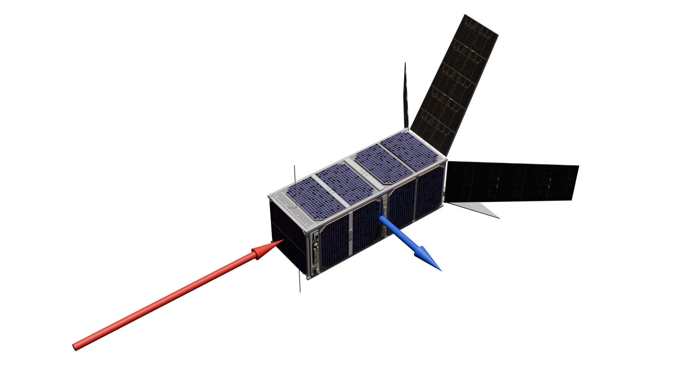
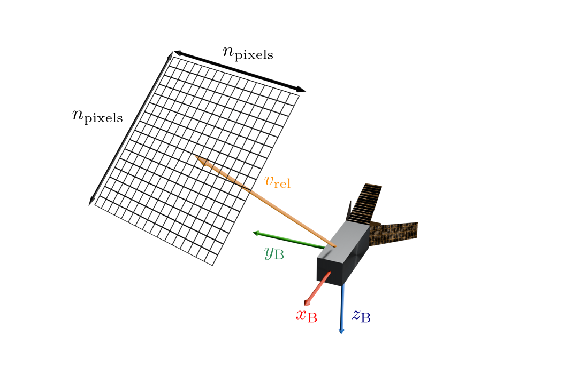

> **For the original MATLAB/panel-method implementation** described in
> Geyer et al., *"Aerodynamic attitude control of very-low-earth-orbit
> satellites: simulative analysis and insights into nonlinear system
> properties,"* CEAS Space Journal (2025).
> [https://doi.org/10.1007/s12567-025-00684-x](https://doi.org/10.1007/s12567-025-00684-x)
> please visit: [the `legacy-matlab-panel-method` branch](https://github.com/ifrunistuttgart/vleo-aerodynamics-tool/tree/legacy-matlab-panel-method)
> (see tag [`paper-v1.0`](../../releases/tag/paper-v1.0)). Development has
> since moved to a faster, GPU-accelerated toolbox

# VLEO Aerodynamics Tool (VAT)

The VLEO Aerodynamics Tool provides algorithms for fast calculations of panel shadowing and force/torque calculations in free-molecular flow (FMF) conditions based on classical graphics pipelines ([OpenGL](https://www.opengl.org/)).




## Main features
- **Six GSI models**, interchangeable at runtime: Sentman, Maxwell, Cook, Schaaf–Chambre,
  Storch, Newton.
- **Two shading algorithms**, Binary and CoP, with the raster resolution as a single
  accuracy/runtime knob.
- **Articulated geometry** — individual meshes (solar arrays, panels for aerodynamic actuation) can be rotated
  about an arbitrary hinge axis between evaluations.
- **A C++20 library and MATLAB bindings** over the same pipeline, so exploratory work in MATLAB
  and production sweeps in C++ give identical numbers.


## Why VAT is so fast
This toolbox does the visibility test (*shadowing analysis*) on the GPU, by rasterizing the mesh along the flow direction.
Geometry and models are initialized once; each subsequent change in flow direction or mesh rotation costs one render pass plus a per-triangle GSI evaluation. This removes the need for precomputation ("Databases").

One computation takes about 1 to 20 ms, depending on geometry and number of pixels.


## Requirements

- **Windows 10/11.** (Linux/MacOS support is WIP)
- **Visual Studio 2022 Build Tools** (C++ workload). The one dependency you install by hand:
  conda-forge can locate an installed compiler but may not redistribute `cl.exe` itself.
- **A GPU and driver supporting OpenGL 4.3 core profile.** The shading pipeline requires it.
- **[pixi](https://pixi.sh)**, which provisions everything else — CMake, Ninja, VTK, assimp,
  GLEW, GLFW, glm, spdlog — into a project-local environment.
- **MATLAB R2024a or newer**, optional, only for the MATLAB bindings.

## Install and run

### C++

```powershell
pixi install                                   # one-time: resolve and download dependencies
pixi run build                                 # build the library and examples
pixi run run-example compute_force_and_torque  # force/torque on a shuttlecock geometry
pixi run run-example import_and_visualize      # load a mesh and view it
```


## How it works



An orthographic camera is placed along the flow direction, looking at the satellite, and the
mesh is rendered into an `n_pixels × n_pixels` buffer in which each triangle draws its own ID.
Any triangle whose ID survives to the final image is exposed to the flow; anything hidden behind
another part of the spacecraft is not. The GSI model is then evaluated per triangle, weighted by
that visibility, and summed into a total force and torque.

`num_pixel` is the accuracy knob: higher resolution resolves finer geometry, at the cost of
render time.

**Flow direction convention.** `v_rel_B__m_per_s` is the velocity of the *satellite relative to
the atmosphere*, expressed in the body frame — the orange vector above.

## Minimal example (C++)

```cpp
auto satellite = std::make_unique<RotatableMeshSatellite>("shuttlecock_15k.obj");
auto gsi_model = std::make_unique<Sentman>(1, 0.9f);   // temperature ratio method, alpha_e

// The pipeline is built once; shading any further direction is then cheap.
auto pipeline = std::make_unique<ShadingPipeline>(
    *satellite, ShadingAlgorithmType::CoP, /*num_pixel=*/4000);

auto calculator = std::make_unique<HybridForceTorqueCalculator>(
    *satellite, *pipeline, *gsi_model);

AeroConditions conditions{
    .density__kg_per_m3 = 1.2482e-11f,
    .T_atmospheric__K   = 934.0f,
    .particle_mass__kg  = 16 * 1.6605390689252e-27f,
};

glm::vec3 v_rel__m_per_s(0.0f, -7800.0f, 0.0f);
glm::vec3 force__N(0.0f), torque__Nm(0.0f);
calculator->calc_aero_torque_force(
    v_rel__m_per_s, /*surface_temp__K=*/300.0f, conditions, torque__Nm, force__N);
```

The full program, including visualization of the shading result, is in
[examples/compute_force_and_torque/](examples/compute_force_and_torque/).

## From MATLAB

The bindings are off by default — building the core library never requires MATLAB.

```powershell
pixi run build-matlab
```

This produces `matlab/bin/MexGateway.mexw64` together with every DLL it needs, copied in
alongside it, so no `PATH` changes are required. Then, in MATLAB:

```matlab
addpath('<repo_root>\matlab')
addpath('<repo_root>\matlab\bin')
cd('<repo_root>\matlab\examples')
quickstart
```

[quickstart.m](matlab/examples/quickstart.m) walks through the whole path — atmosphere, GSI
model, geometry, shading, force and torque — and ends by visualizing which surfaces the flow
reached. [soar_rotatable.m](matlab/examples/soar_rotatable.m) goes further, sweeping the
aerodynamic torque over a full sphere of flow directions with one panel deflected.

Logging defaults to DEBUG, which is slow because every message crosses into the MATLAB engine.
Turn it down with `setLogLevel("warn")` before benchmarking.

## Gas–surface interaction models

All six implement the same `IGSIModel` interface and can be substituted for one another without
touching the rest of the pipeline. Parameters can also be set by name at runtime, via
`set_gsi_parameter` / `get_gsi_parameter`.

| Model | Constructor | Parameters |
|---|---|---|
| `Sentman` | `Sentman(temperature_ratio_method, alpha_e)` | energy accommodation |
| `Maxwell` | `Maxwell(alpha_e)` | energy accommodation |
| `Cook` | `Cook(alpha_e)` | energy accommodation |
| `SchaafChambre` | `SchaafChambre(sigma_n, sigma_t)` | normal and tangential momentum accommodation |
| `Storch` | `Storch(V_w, sigma_n, sigma_t)` | wall velocity, normal and tangential momentum accommodation |
| `Newton` | `Newton()` | none |


## Status

Actively developed research code. Be aware, bugs might still exist.

## Citation

If VAT contributes to published work, please cite:

> Geyer et al., *"Aerodynamic attitude control of very-low-earth-orbit satellites: simulative
> analysis and insights into nonlinear system properties,"* CEAS Space Journal (2025).
> [doi.org/10.1007/s12567-025-00684-x](https://doi.org/10.1007/s12567-025-00684-x)

That paper describes the original MATLAB panel-method implementation, which lives on the
[`legacy-matlab-panel-method`](https://github.com/ifrunistuttgart/vleo-aerodynamics-tool/tree/legacy-matlab-panel-method)
branch at tag [`paper-v1.0`](https://github.com/ifrunistuttgart/vleo-aerodynamics-tool/releases/tag/paper-v1.0).
Use that branch to reproduce the
paper; this one is its GPU-accelerated successor.

## License

GNU General Public License v3.0 — see [LICENSE](LICENSE).
