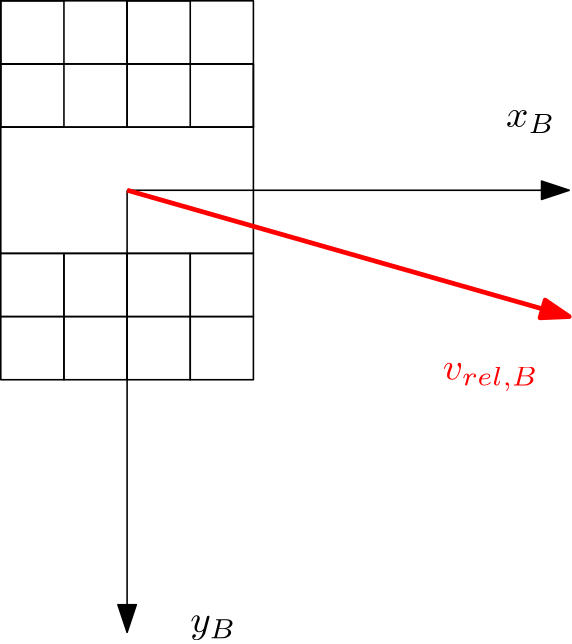

# AeroSat Toolbox
Modular C++ toolbox for aerodynamic analysis of VLEO satellites, combining computer-graphics-based surface visibility (shading) with gas-surface interaction (GSI) models.

The toolbox is designed for research workflows where many configurations must be evaluated efficiently (attitude changes, flow directions, atmospheric conditions, and model parameters).

## Scientific Goal
The main goal is to initialize geometry/model data once and then compute aerodynamic force and torque quickly for many parameter combinations.

Typical target applications:
- Comparative studies of GSI models
- Sensitivity analyses for atmosphere/surface parameters
- Fast generation of aerodynamic loads for simulation pipelines (for example Sadycos coupling)
- Method development for GPU-based shading and force/torque acceleration

## Researcher-Oriented Use Cases
- Implement and benchmark new aerodynamic/GSI models
- Implement new shading algorithms (CPU or GPU)
- Implement alternative aggregation methods for total force/torque
- Load custom satellite geometries (target path includes custom formats and `.urdf` workflows)
- Run sweeps over orientation, flow vector, and environment parameters
- Integrate aerodynamic load computation into external simulation frameworks

## Architecture Overview
- `AeroSat/Core/`: Core interfaces and shared data types (`IAeroCalculator`, `ISatellite`, `AeroConditions`)
- `AeroSat/GSI/`: GSI model implementations (currently Sentman, plus Schuette scaffold)
- `AeroSat/Aero_Force_Torque/`: Force/torque calculation abstraction layer
- `AeroSat/Satellite/`: Satellite geometry and manipulation abstractions
- `AeroSat/Shader/`: Shading strategy abstractions and OpenGL-related components
- `tests/GSI.Test/`: GoogleTest-based validation of aerodynamic model behavior

The architecture is interface-first so researchers can replace individual components without rewriting the full pipeline.

## Build and Dependencies
- Language standard: C++20
- Dependency management: `vcpkg` manifest mode
- Main dependencies: `eigen3`, `spdlog`, `glm`, `gtest`
- Solution file: `AeroSat.slnx`

## Logging
`spdlog` is used for logging across the project.

## Naming Conventions
### General
The naming style is inspired by Python PEP 8 while following C++ interface conventions.
- Class names: PascalCase, for example `Satellite`
- Interfaces: PascalCase with `I` prefix, for example `ISatellite`
- Member variables: snake_case
- Functions: snake_case, for example `calculate_drag`
- Variables: snake_case, for example `drag_coefficient`
- Constants: UPPER_SNAKE_CASE, for example `PI`

### Units in identifiers
- Use `__` to separate variable name and unit suffix
- Use `_per_` for fractional units, for example `__m_per_s`
- Put exponents directly after unit symbols, for example `__m2`

### Velocity defintion
The velocity of the incoming stream of molecules is defined in the body coordinate system of the satellite an will be referenced as `v_rel_B__m_per_s`. The following sketch illustrates that definition.

