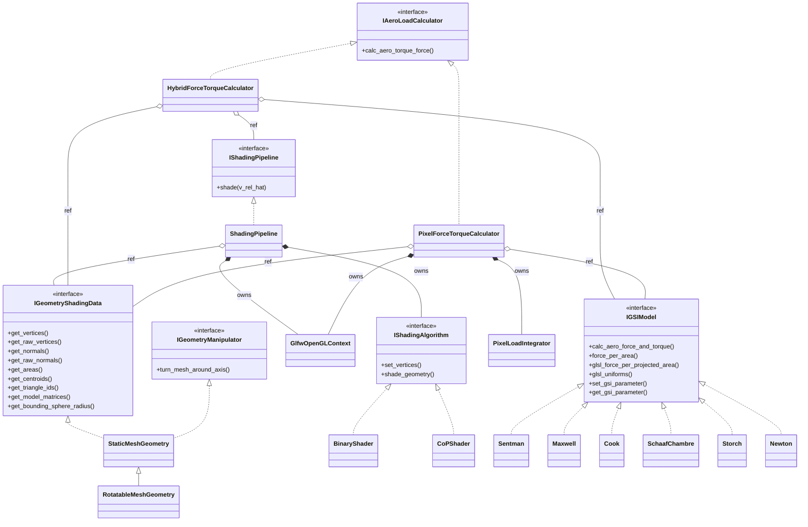

# Architecture

VAT is built from a handful of interfaces. Every concrete class is interchangeable with any other
implementation of the same interface, and nothing downstream knows which one it received. That
is what makes it cheap to add a GSI model, swap a shading algorithm or a load calculator, or drop
in a different geometry source without touching the rest of the pipeline.

## Class diagram

Solid diamonds are ownership (`unique_ptr`); open diamonds are non-owning references. Every
object the calculators and the pipeline use must therefore outlive them — the caller owns the
geometry, the pipeline and the GSI model, and passes them in by reference. (The MATLAB class
`vat.loads.PixelForceTorqueCalculator` holds on to its geometry and GSI model for that reason.)

## The interfaces

**`IGeometryShadingData`** ([core/Igeometry_shading_data.h](../src/core/Igeometry_shading_data.h))
supplies geometry: vertices, per-triangle normals, areas, centroids, triangle IDs, per-mesh
model matrices, and the bounding sphere radius. Vertices and normals come in two flavours, see
*Raw versus transformed* below. It is the only thing the rest of the pipeline
knows about geometry.

**`IGeometryManipulator`** ([core/Igeometry_manipulator.h](../src/core/Igeometry_manipulator.h))
is deliberately separate. Articulating a part — deflecting a solar array, feathering a panel —
writes a per-mesh model matrix; it never touches vertex data.

**`IShadingPipeline`** ([aero_load_calculator/Ishading_pipeline.h](../src/loads/Ishading_pipeline.h))
answers one question: given a flow direction, which fraction of each triangle is exposed?
`ShadingPipeline` implements it by owning a hidden GLFW window for the OpenGL context and
delegating the actual rendering to an `IShadingAlgorithm`.

**`IGSIModel`** ([aero_load_calculator/Igsi_model.h](../src/loads/Igsi_model.h))
computes force and torque for a *single* triangle from its area, normal, centroid, the
flow vector, the surface temperature and the atmospheric conditions. It knows nothing about
occlusion — that is the pipeline's job. Every model carries the same formula twice:
`force_per_area()` in C++ (force per unit wetted area, including shear;
`calc_aero_force_and_torque()` is that times the area) and `glsl_force_per_projected_area()`
in GLSL for the GPU, with `glsl_uniforms()` supplying the values its uniforms need. The two
are tested against each other on random inputs
([test_glsl_matches_cpp.cpp](../test/gsi_models/test_glsl_matches_cpp.cpp)).

**`IAeroLoadCalculator`** ([core/Iaero_load_calculator.h](../src/core/Iaero_load_calculator.h))
is the composition point that turns per-element physics into a total load. There are two:
`HybridForceTorqueCalculator` works per triangle, `PixelForceTorqueCalculator` per pixel.

## How one evaluation flows (Hybrid)

`HybridForceTorqueCalculator::calc_aero_torque_force` is the whole story in one loop
([hybrid_aero_load_calculator.cpp](../src/loads/hybrid_aero_load_calculator.cpp)):

1. Shade once for the given flow direction, producing one visibility factor per triangle.
2. For each triangle, ask the GSI model for its force and torque contribution.
3. Multiply that contribution by the triangle's visibility factor and accumulate.

Back-facing triangles — those with `dot(normal, v_rel) <= 0` — bypass the shading result and are
assigned visibility 1.0. This is safe because the GSI model is itself responsible for returning
approximately zero force on a leeward element, and it avoids paying for a visibility lookup on
triangles that cannot be loaded anyway.

## How one evaluation flows (Pixel)

`PixelForceTorqueCalculator` ([pixel_force_torque_calculator.cpp](../src/loads/pixel_force_torque_calculator.cpp))
does not ask which triangles are visible, it integrates the load over the visible *surface*.
It owns its own hidden OpenGL context and needs no shading pipeline.

1. **G-buffer pass.** The same orthographic camera along the flow as the shading algorithms
   (`gl::make_flow_camera`) renders the body-frame position and normal of the front-most
   surface into two RGBA32F targets. Face culling is off, so a sheet facing away from the flow
   still shades what lies behind it. No physics happens here; this pass is the same for every
   model.
2. **Integration pass** ([pixel_load_integrator.cpp](../src/loads/pixel_load_integrator.cpp)).
   One compute shader, assembled from the model's GLSL, visits every pixel whose surface faces
   the flow (`cos(delta) = dot(n, v_hat) > 0`) and adds
   `dF = f(n, v, T_w) * A_px` and `dT = r x dF`, where `f` is the model's force per *projected*
   area (`force_per_area / cos(delta)`), `A_px = (2R/N)^2` and `r` the interpolated position. Each
   16x16 workgroup reduces a 32x32 tile in shared memory, in a fixed order, and writes one
   partial sum; the CPU adds those in double, also in a fixed order. No float atomics, so the
   result is bit-for-bit reproducible on a given GPU and driver.
3. **Leeward triangles**, `dot(n, v) <= 0`, are invisible to the camera. They are evaluated per
   triangle on the CPU with `calc_aero_force_and_torque()` and no shadowing, exactly as Hybrid
   does. Degenerate triangles (NaN normal) are skipped.

Partly shaded triangles therefore count with exactly their exposed part, and the result depends
on `num_pixel` only, not on the meshing: a plate as 2 or as 10,000 triangles gives the same
loads to 1e-5, and the error against analytic results falls like 1/N
([pixel_force_torque_accuracy_test.cpp](../test/loads/pixel_force_torque_accuracy_test.cpp)).

**Grazing incidence.** Working per projected area turns `A_px / cos(delta)` into a finite factor
for the hyperthermal models: Newton, Cook and Storch divide the `cos(delta)` out analytically.
The thermal models (Sentman, Schaaf–Chambre, Maxwell) keep a non-zero load at `cos(delta) -> 0`,
so they divide by `max(cos(delta), min_cos_delta)` (`PixelLoadOptions`, default 1e-3). A surface
seen almost edge-on covers few pixels with large weight each, which is where the thermal models
are least accurate.

**Diagnostics.** `last_wetted_area()` and `last_projected_area()` report the areas the last
evaluation integrated over; with `keep_pressure_image` set, `pressure_image()` returns the
per-pixel pressure.

**Choosing a calculator.** `perf_probe <mesh> --pixel` compares both on any mesh. Hybrid's
visibility is all-or-nothing per triangle, so on meshes with large, partly shaded triangles its
result converges to a mesh-dependent value. On `shuttlecock_15k.obj` with Sentman, Hybrid at
N = 4000 stays up to 2.6% (Binary) and 1.9% (CoP) in force away from the converged pixel result
over the probe's four flow directions, while the pixel result at N = 4000 is within 0.04%.
Hybrid remains the reference for convex bodies, where both agree to O(1/N).

## The two shading algorithms

Both render under an orthographic projection along the flow direction, and both currently return
0.0 or 1.0 per triangle, though the interface permits fractional values.

- **`BinaryShader`** renders triangle IDs. A triangle counts as visible if any pixel carries
  its ID.
- **`CoPShader`** renders triangle depth, then re-renders each triangle's *centre of pressure*
  (its centroid) as a single point with a small depth bias. The triangle is visible if that
  point survives the depth test. This carries less area-quantization bias than the binary
  approach at the same resolution.

`num_pixel` is the square render resolution, and the single accuracy/runtime knob.

## Geometry data layout

Two details are easy to get wrong and worth stating explicitly.

**Vertices are de-indexed.** `StaticMeshGeometry` loads through assimp with
`aiProcess_Triangulate | aiProcess_JoinIdenticalVertices`, then expands the result so that
`m_vertices` holds nine floats per triangle — three explicit vertices. Consequently
`get_triangle_ids()` is **not** an index buffer. It is a per-vertex `uint32` attribute carrying
the same value three times, used as a render-target colour. IDs are **1-based**, so a `0` in the
ID framebuffer means background.

**Raw versus transformed vertices.** `RotatableMeshGeometry` overrides the getters to apply the
per-mesh model matrices, so `get_vertices()` and `get_normals()` return already-transformed
geometry. The GPU paths instead upload `get_raw_vertices()` and `get_raw_normals()`, because they
apply the model matrices themselves — uploading the transformed data would apply the rotation
twice. Positions are transformed with `w = 1`; normals go through the inverse transpose of the
linear block only, on the CPU and on the GPU alike, so they never pick up the model matrix's
translation column.

## Target layout

One CMake target per `src/` subdirectory, each with a `Vat::` alias and its own
`target_include_directories`. Headers are therefore included flat — `#include "sentman.h"` —
never by relative path. `core` is header-only (INTERFACE). The subdirectories under
`shading/` (`binary_shader/`, `cop_shader/`) and the `shaders/` folders of `loads/` and
`gsi_models/` define no targets of their own; they `target_sources(...)` into the parent.

`loads` links `gl` PRIVATE: no public `loads` header exposes an OpenGL type (the pixel
calculator keeps its GL state behind a pimpl), so the GSI models, which link `loads` for
`IGSIModel`, do not compile against the GL wrappers.

## Namespaces

Everything lives under `vat`. The cross-module vocabulary sits at the root, and each
module gets a nested namespace named after its folder and CMake target:

| namespace | holds |
|---|---|
| `vat` | `AeroConditions` and the five interfaces every module speaks: `IGSIModel`, `IShadingPipeline`, `IAeroLoadCalculator`, `IGeometryShadingData`, `IGeometryManipulator` |
| `vat::gsi_models` | `Sentman`, `Cook`, `Maxwell`, `Newton`, `SchaafChambre`, `Storch` |
| `vat::geometry` | `StaticMeshGeometry`, `RotatableMeshGeometry` |
| `vat::shading` | `ShadingPipeline`, `ShadingAlgorithmType`, `IShadingAlgorithm`, `BinaryShader`, `CoPShader`, `VisibilityReducer` |
| `vat::loads` | `HybridForceTorqueCalculator`, `PixelForceTorqueCalculator`, `PixelLoadOptions`, `PixelLoadIntegrator` |
| `vat::visualization` | `ShowMeshWithShadingAndWind` |
| `vat::gl` | the OpenGL wrappers — `Shader`, `ComputeShader`, `VertexArray`, `VertexBuffer`, `FrameBuffer`, … — plus `make_flow_camera`, the orthographic camera along the flow every GPU path uses, and `ScopedCurrentContext`, which makes a context current and restores the previous one |

One deliberate exception to "namespace == folder":

- The root-namespace contracts are spread across `core/` and `loads/` rather than living in
  one folder, because a header's folder decides which CMake target owns it. `IGSIModel` and
  `IShadingPipeline` are compiled into `loads` but are named `vat::IGSIModel` and
  `vat::IShadingPipeline`, not `vat::loads::…`.

`gl` is a module in its own right, at `src/gl/`, not a part of shading. Its wrappers carry
generic names — `Shader`, `VertexBuffer` and `FrameBuffer` would collide with any other
renderer linked into the same program — which is what the namespace is for. Shading is
simply its first consumer; anything else that moves work onto the GPU links `gl` the same
way, without depending on shading.

`.cpp` files inside `vat::shading` open with a TU-local `using namespace gl;` so the OpenGL
call sites stay readable. That directive never appears in a header.

The embedded GLSL sources get one namespace per backend — `vat::shading::binary_glsl`,
`vat::shading::cop_glsl`, `vat::loads::pixel_glsl`, and one per GSI model
(`vat::gsi_models::sentman_glsl`, …, with the shared helpers such as `vat_erfc` in
`vat::gsi_models::common_glsl`). The two shading backends both declare `ID_vertex_shader` and `ID_fragment_shader`,
and before this they were two `inline` definitions of the same global name. Identical text
made that legal, but the moment one backend's GLSL was edited alone it would have become a
silent ODR violation, with the linker keeping one definition and one backend rendering with
the other's shader. Separate namespaces let the two diverge freely.

`MexFunction` in [mex_gateway.cpp](../bindings/matlab/mex_gateway.cpp) stays in the global namespace —
MATLAB resolves the entry point by that exact name — so that file pulls in the toolbox types
with individual `using` declarations instead of being wrapped.
