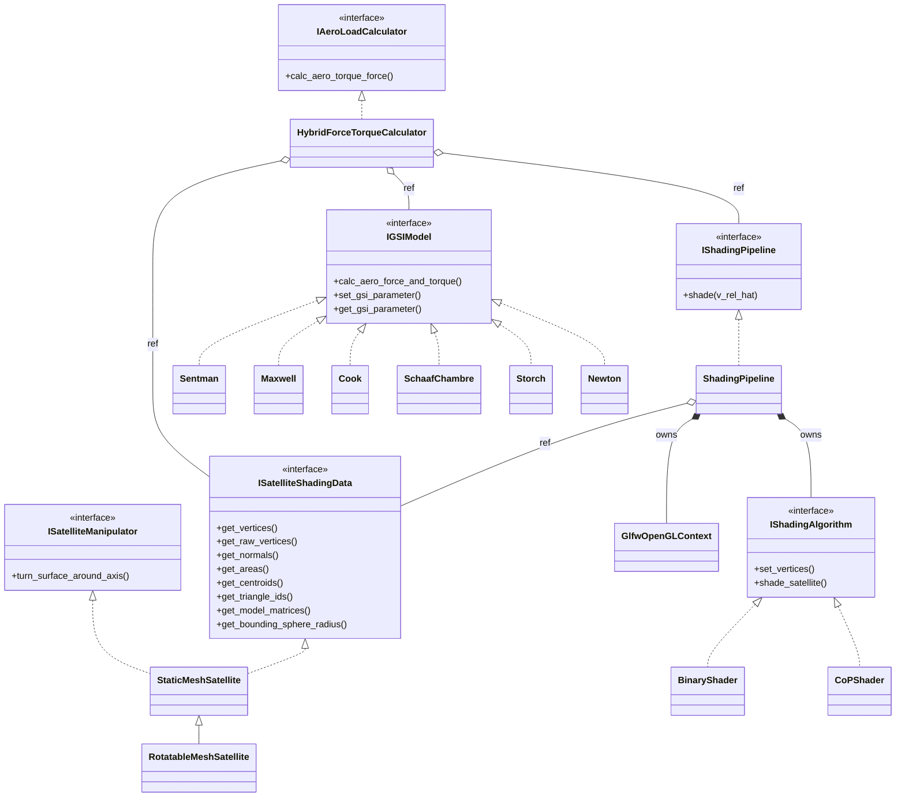

# Architecture

VAT is built from four interfaces. Every concrete class is interchangeable with any other
implementation of the same interface, and nothing downstream knows which one it received. That
is what makes it cheap to add a GSI model, swap a shading algorithm, or drop in a different
geometry source without touching the rest of the pipeline.

## Class diagram

Solid diamonds are ownership (`unique_ptr`); open diamonds are non-owning references. Every
object the calculator and the pipeline use must therefore outlive them — the caller owns the
satellite, the pipeline and the GSI model, and passes them in by reference.

## The four interfaces

**`ISatelliteShadingData`** ([core/Isatellite_shading_data.h](../aero_sat/core/Isatellite_shading_data.h))
supplies geometry: vertices, per-triangle normals, areas, centroids, triangle IDs, per-mesh
model matrices, and the bounding sphere radius. It is the only thing the rest of the pipeline
knows about geometry.

**`ISatelliteManipulator`** ([core/Isatellite_manipulator.h](../aero_sat/core/Isatellite_manipulator.h))
is deliberately separate. Articulating a part — deflecting a solar array, feathering a panel —
writes a per-mesh model matrix; it never touches vertex data.

**`IShadingPipeline`** ([aero_load_calculator/Ishading_pipeline.h](../aero_sat/aero_load_calculator/Ishading_pipeline.h))
answers one question: given a flow direction, which fraction of each triangle is exposed?
`ShadingPipeline` implements it by owning a hidden GLFW window for the OpenGL context and
delegating the actual rendering to an `IShadingAlgorithm`.

**`IGSIModel`** ([aero_load_calculator/Igsi_model.h](../aero_sat/aero_load_calculator/Igsi_model.h))
computes force and torque for a *single* surface element from its area, normal, centroid, the
flow vector, the surface temperature and the atmospheric conditions. It knows nothing about
occlusion — that is the pipeline's job.

**`IAeroLoadCalculator`** ([core/Iaero_load_calculator.h](../aero_sat/core/Iaero_load_calculator.h))
is the composition point that turns per-element physics into a total load.

## How one evaluation flows

`HybridForceTorqueCalculator::calc_aero_torque_force` is the whole story in one loop
([hybrid_aero_load_calculator.cpp](../aero_sat/aero_load_calculator/hybrid_aero_load_calculator.cpp)):

1. Shade once for the given flow direction, producing one visibility factor per triangle.
2. For each triangle, ask the GSI model for its force and torque contribution.
3. Multiply that contribution by the triangle's visibility factor and accumulate.

Back-facing triangles — those with `dot(normal, v_rel) <= 0` — bypass the shading result and are
assigned visibility 1.0. This is safe because the GSI model is itself responsible for returning
approximately zero force on a leeward element, and it avoids paying for a visibility lookup on
surfaces that cannot be loaded anyway.

## The two shading algorithms

Both render under an orthographic projection along the flow direction, and both currently return
0.0 or 1.0 per triangle, though the interface permits fractional values.

- **`BinaryShader`** renders triangle IDs. A triangle counts as visible if any pixel carries
  its ID.
- **`CoPShader`** renders triangle depth, then re-renders each triangle's *centre of pressure*
  (its centroid) as a single point with a small depth bias. The triangle is visible if that
  point survives the depth test. This carries less area-quantization bias than the binary
  approach at the same resolution.

`num_pixel` is the square render resolution, and the single accuracy/runtime knob.

## Geometry data layout

Two details are easy to get wrong and worth stating explicitly.

**Vertices are de-indexed.** `StaticMeshSatellite` loads through assimp with
`aiProcess_Triangulate | aiProcess_JoinIdenticalVertices`, then expands the result so that
`m_vertices` holds nine floats per triangle — three explicit vertices. Consequently
`get_triangle_ids()` is **not** an index buffer. It is a per-vertex `uint32` attribute carrying
the same value three times, used as a render-target colour. IDs are **1-based**, so a `0` in the
ID framebuffer means background.

**Raw versus transformed vertices.** `RotatableMeshSatellite` overrides the getters to apply the
per-mesh model matrices, so `get_vertices()` returns already-transformed geometry. The shading
pipeline instead uploads `get_raw_vertices()`, because the GPU path applies the model matrices
itself — uploading the transformed vertices would apply the rotation twice. Positions are
transformed with `w = 1`; normals go through a separate path using the linear block only, so
they never pick up the model matrix's translation column.

## Target layout

One CMake target per `aero_sat/` subdirectory, each with an `AeroSat::` alias and its own
`target_include_directories`. Headers are therefore included flat — `#include "sentman.h"` —
never by relative path. `core` is header-only (INTERFACE). The subdirectories under
`shading_pipeline/` (`opengl/`, `binary_shader/`, `cop_shader/`) define no targets of their own;
they `target_sources(...)` into the parent.
