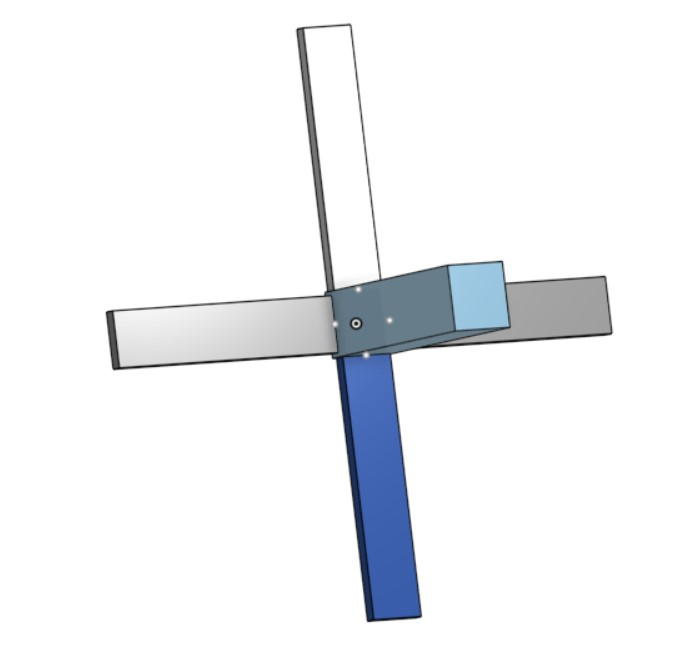
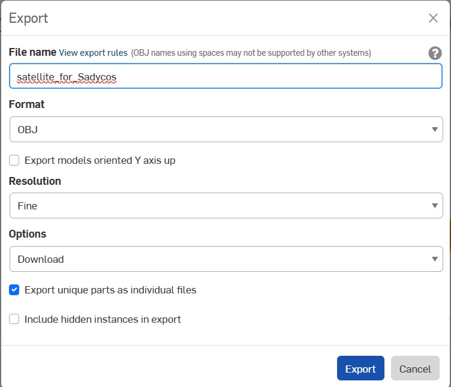
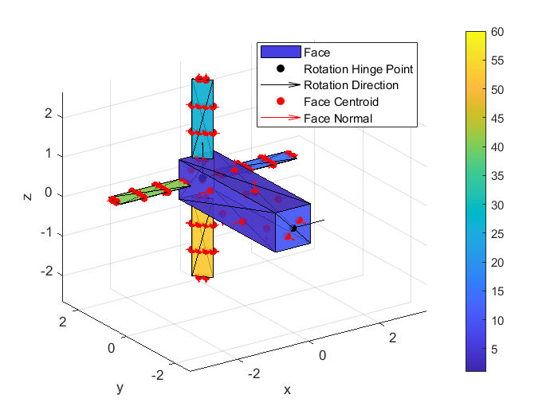

# QuickStart-Guide: VLEO Aerodynamic Tool
This Wiki-Blog serves as a step-by-step guide to the vleo-aerodynamics-tool in the Sadycos project. It provides a structured introduction using a simple example:


The goal is to compute the torque around the z-axis for a satellite with four rotatable panels. Specifically, we will examine the torque when Panels 2 and 4 are rotated by 45°, allowing us to analyze the pitch motion of the satellite. The satellite’s orientation relative to the wind direction is defined by a pitch angle (α) of 45°.

## Preparatory work

Let´s assume you conduct research work in the field of attitude and aerodynamic control of VLEO satellites and are interested in the forces and torques acting on your satellite configuration.
In this example, the satellite is a prototype created in the CAD software Onshape and consists of a main body which has a rotatable wing on each side of your satellite back end. 

**Note that the main body as well as each wing of the satellite should be a part of its own, as we want to be able to rotate each wing independent to each other.** 



It consists of five parts. The main body and four wings or control surfaces which are divided in right, left, bottom and top. 

You can then export these parts as independent .obj-files.

**Remember to check the box "Export unique parts as individual files"**




## Import of bodies

The satellite configuration can now be imported into the workflow. 
Here ``object_files`` imports the individual files by calling its exact name. Make sure to keep them in the same path as the one you are working in. 

```Matlab
% Create inputs to import function
% Get absolute path of test folder
[test_folder,~,~] = fileparts(mfilename("fullpath"));
% Get absolute paths of all obj files
object_files = string(fullfile(test_folder, 'obj_files_test', ...
                                {'body_test.obj', ...
                                     'right_control_surface_test.obj', ...
                                     'bottom_control_surface_test.obj', ...
                                     'left_control_surface_test.obj', ...
                                     'top_control_surface_test.obj'
                                     }));
```
To ckeck, if the parts are correctly imported call object_files in the command window.

In the case of this example, consisting of five unique parts, the command bar should return a 1x5 string array consisting of the path to the .obj-files:

```git bash
object_files = 

  1×5 string array

    "C:\Users\maier\Docume…"    "C:\Users\maier\Docume…"    "C:\Users\maier\Docume…"    "C:\Users\maier\Docume…"    "C:\Users\maier\Docume…"
```    

## Prepare imported bodies for processing

The following commands are the inputs for the ``importMultipleBodies``-function and ensure that the satellite parts are formatted correctly, allowing for accurate torque and force calculations in the next step.

**Be aware of the dimensions between your CAD frame and the Matlab frame.**

```Matlab
rotation_hinge_points_CAD = [0,  0,  0, 0,  0; ...
                             0,   3.75,  3.75,   3.75,  3.75; ...
                             0,   0, 0,  0, 0];


rotation_directions_CAD = [1,  1,  0,  1,  0; ...
                           0,  0,  0,  0,  0; ...
                           0,  0,  1,  0,  1];


surface_temperatures__K = num2cell([300, 300, 300, 300, 300]);


surface_energy_accommodation_coefficients = num2cell(0.9*ones(1,5));


DCM_B_from_CAD = [1, 0, 0;...
                  0, 1, 0; ...
                  0, 0, 1];


CoM_CAD = [0; 2; 0];
```
The following three definitions need further explanation:

- ``rotation_hinge_points_CAD`` defines the position of the rotation axis or each component relative to the CAD coordinate system. Each panel doesn`t rotate around its own center but rather around a specific hinge point, typically located where the panel is attached to the main body. The hinge points ensure that the rotation (defined in ``rotation_directions_CAD``) occur and intendetd, matching the real-world configuration from the CAD model.

The hinge points of the four panels have the same reference point which is sufficient for this example.

- ``rotation_directions_CAD`` defines the axis for rotation of each part. Remember that this is in the CAD frame, so the main body, wing 1 and 3, which are name ``right_conrol_surface`` and ``left_control_surface``, rotate with respect to the x-axis and wing 2 and 4 with respect to the z-axis. In our example we want the panels 2 and for, ``bottom_control_surface`` and ``top_control_surface`` respectively, to rotate 45° around the z-axis, which is achieved by the given matrix.

- ``DCM_B_from_CAD`` is better known as the Direction Cosine Matrix and represents the rotation from the CAD coordinate frame to the body-fixed frame. It transforms vectors from the CAD frame (the coordinate system used to design the satellite) into the body frame (which moves with the satellite).

If you are working with a satellite that was designed in a different coordinate system that does not match the body frame used in this example, you can use the DCM_B_from_CAD matrix to define the necessary rotation from the CAD frame to the body frame.

**Note that the identity matrix is the default case when the satellite's CAD frame aligns with the body frame, as seen in this example.**


## importMultipleBodies-function

The ``importMultipleBodies`` function is defines in a submodule and has all of the above defined arguments as input. 

```Matlab
bodies = importMultipleBodies(object_files, ...
    rotation_hinge_points_CAD, ...
    rotation_directions_CAD, ...
    surface_temperatures__K, ...
    surface_energy_accommodation_coefficients, ...
    DCM_B_from_CAD, ...
    CoM_CAD);
```

It outputs a 1x5 cell array consisting of 1x1 structs consisting of the geometrical informations defining each part.
```
bodies =

  1×5 cell array

    {1×1 struct}    {1×1 struct}    {1×1 struct}    {1×1 struct}    {1×1 struct}
```

## showBodies-function

The ``showBodies``-function is also in a submodule and helps visualizing the satellite. With that you are able to see how the changes you made influence the movement of your satellite. It also helps with validation.

```Matlab
showBodies(bodies, [0, 0, deg2rad(45), 0 ,deg2rad(45)], 0.75, 0.25, ...
    {(1:12), 12 + (1:12), 24 + (1:12), 36 + (1:12), 48 + (1:12)});
```
The second input argument is an array specifying the rotation angles for each component. In line with our objective, Panels 2 and 4 are rotated by 45°, while all other satellite components remain unrotated.




## Calculate the aerodynamic forces and torques for different control surface rotations
In order to calculate the aerodynamic forces and torques several environmental parameters, such as the wind velocity, have to be definded. You can configurate them as you wish.

```Matlab
% Constants
altitude__m = 3e5;
gravitational_parameter__m3_per_s2 = 3.986e14;
radius__m = 6.378e6;

rotational_velocity_BI_B__rad_per_s = 0;
velocity_I_I__m_per_s = sqrt(gravitational_parameter__m3_per_s2 ...
                             / (radius__m + altitude__m)) * [1;0;0];
wind_velocity_I_I__m_per_s = - velocity_I_I__m_per_s .* [cosd(45); 0; sind(45)];
[T, R] = atmosnrlmsise00(altitude__m, 0, 0, 2024, 150, 0);
density__kg_per_m3 = R(6);
temperature__K = T(2);
particles_mass__kg = 16 * 1.6605390689252e-27;
temperature_ratio_method = 1;
```

To simulate the wind direction with a 45° pitch angle as the stated in the objective, the relative velocity vector must be rotated downward along the body-frame y-axis, corresponding to a pitch motion. Consequently, the wind velocity in the inertial frame should be defined as:

``wind_velocity_I_I__m_per_s = - velocity_I_I__m_per_s .* [cosd(45); 0; sind(45)];``


## vleoAerodynamics-function

The  ``vleoAerodynamics``-function allows the calculation of forces and torques, which can then be used for controller design etc. For a more detailed description refer to the Readme.md-file.
````Matlab
[aerodynamic_force_B__N(:,j,i,k), ...
aerodynamic_torque_B_B__Nm(:,j,i,k)] = ...
            vleoAerodynamics(attitude_quaternion_BI, ...
                            rotational_velocity_BI_B__rad_per_s, ...
                            velocity_I_I__m_per_s, ...
                            wind_velocity_I_I__m_per_s, ...
                            density__kg_per_m3, ...
                            temperature__K, ... 
                            particles_mass__kg, ...
                            bodies, ...                                                
                            bodies_rotation_angles__rad, ...
                            temperature_ratio_method);
````

